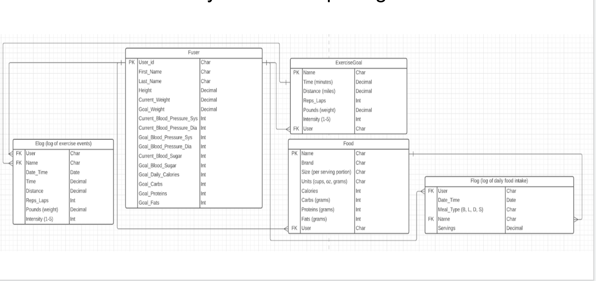

# FitLy - Fitness Tracker
Welcome to **FitLy**, the fitness application designed to help users track exercise progress, set goals, manage nutrition, and achieve GREATNESS. 

## Technologies
- Python
- Django
- PostgreSQL
- HTML5
- CSS3
- Bootstrap

## ERD

## Wireframes
### Login Page

### Profile Page

## Screenshots
### Home Page

### About Page

### Signup Page

### Login

### Create Profile

## Getting Started
[Click here to begin your journey to greatness!](https://fit-max.herokuapp.com/)

## Current Issues
1. Getting error when creating profile. 
2. Having issues creating forms for Exercise and Food logging.
3. Can't display logged Exercises and Meals/Snacks to the Profile Page. 

## Future Enhancements
1. Implement 3rd Party API to show nutrition stats for types of food, ingredients, etc. 
2. Create charts to show user progress over time. 
